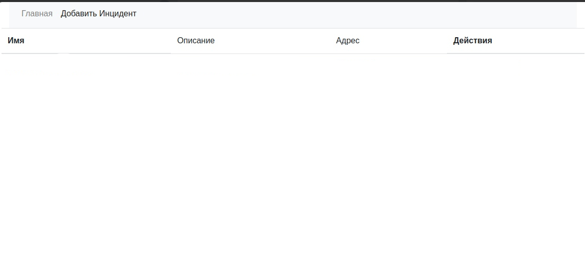
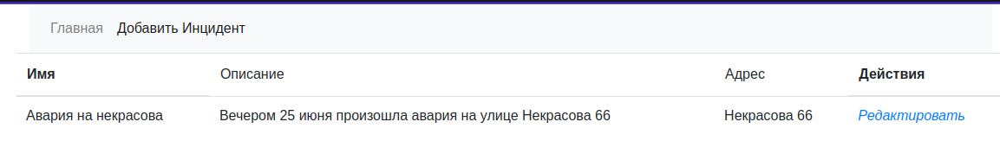

## Проект - Автонарушители

### Использованные технологии

* Spring Framework
* Lombok
* PostgreSQL
* Hibernate
* Junit
* Spring Security
* Collections Framework
* Spring Data JPA
* HTML, CSS, Bootstrap


### В блоке Spring будет разработан проект - Автонарушители. 
Пользователь добавляет описание автонарушения.
В заявлении указывает: название, тип, статьи, описание нарушения, адрес.
Вид системы. Главная страница - это поиск с таблицей.

### Запуск проекта
1. Установить JDK 17
2. Установить Maven
3. Установить PostgreSQL
4. Установить сервер БД PostgreSQL. При установке задать:  
* Имя пользователя - postgres
* Пароль - postgres
* Порт - 5432
5. Создать БД с именем accidents и подключится к ней
6. Выполнить команды по созданию и заполнению таблиц (находятся в папке db.scripts)
  
7. При помощи терминала перейдите в папку 
с исходным кодом и выполните команду: 
```shell
mvn spring-boot:run
```
8. Откройте браузер с URL: http://localhost:8080/

### Взаимодействие с приложением

* С самого начала список нарушений отсутствует, для того чтобы просмотреть 
и создать новые - необходимо зарегистрироваться:


* После авторизации сервис переходит на главную страницу

* Чтобы добавить новый инцидент переходим по ссылке "Добавить инцидент"  

* После сохранения сервис переносит пользователя на главный экран: 

* Инциденты можно редактировать: 




### Контакты 
vithag97@mail.ru